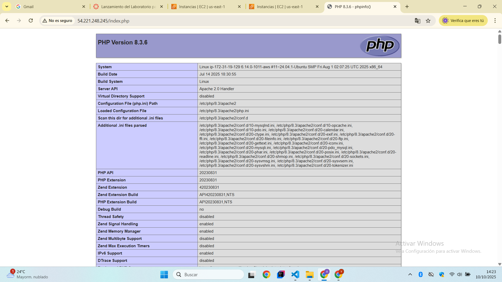
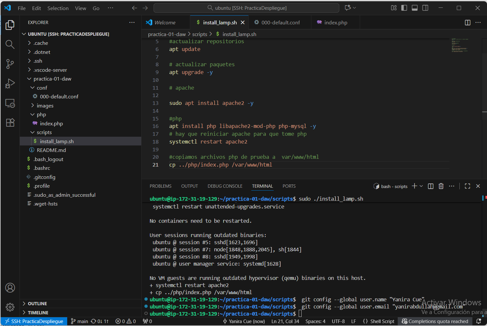

# practica-01-daw
Repositorio para la practica 01 de Despliegue de Aplicaciones Web 

Esta práctica se realizo un despliegue de una pila LAMP  sobre una instancia virtual de Ubuntu Server alojada en AWS EC2, se realizo todo el proceso mediante scripts desde la terminal de code.

# Parte 1
Se creo una instancia virtual en AWS EC2 utilizando una imagen de Ubuntu Server actualizada. Durante la configuración de la instancia, se habilitaron los puertos necesarios para permitir conexiones SSH y para que los servicios web funcionaran correctamente a través de HTTP y HTTPS. Se hizo una clave vockey para poder conectarse de forma segura a la instancia, y se asigno una direccion IP elastica para que la maquina tuviera una dirección fija.

# Parte 2 
La instalacion de la pila LAMP se realizo mediante un script, donde se ejecutaron una serie de comandos.

Con el set -ex, garantiza que al ejecutar cualquier comando debe detenerse si ocurre algun error y que se muestren en pantalla todos los comandos a medida que se ejecutan. 

Luego, con el comando apt update se actualiza la lista de paquetes disponibles en los repositorios de Ubuntu, asegurando que el sistema conoce las versiones mas recientes de los programas.

Despues, apt upgrade -y actualiza todos los paquetes instalados a sus ultimas versiones automaticamente, aplicando mejoras y parches de seguridad sin pedir confirmacion al usuario.

Se utiliza sudo apt install apache2 -y para instalar el servidor web Apache con  lo que permite que el sistema pueda manejar peticiones HTTP y servir paginas web. Este script instala PHP y los modulos necesarios para que PHP funcione con Apache y pueda conectarse a bases de datos MySQL mediante el comando apt install php libapache2-mod-php php-mysql -y.
Para aplicar los cambios y asegurarse de que Apache reconozca la integracion con PHP, el servicio Apache se reinicia con systemctl restart apache2.

Finalmente, el script copia un archivo PHP de prueba al directorio raiz del servidor web con cp ../php/index.php /var/www/html, lo que permite verificar que Apache y PHP estan funcionando correctamente al acceder a la pagina web del servidor.

Esta secuencia automatiza la instalacion y configuracion basica de la pila LAMP, preparando el servidor para alojar aplicaciones web dinamicas.

# Captura 1

# Captura 2
